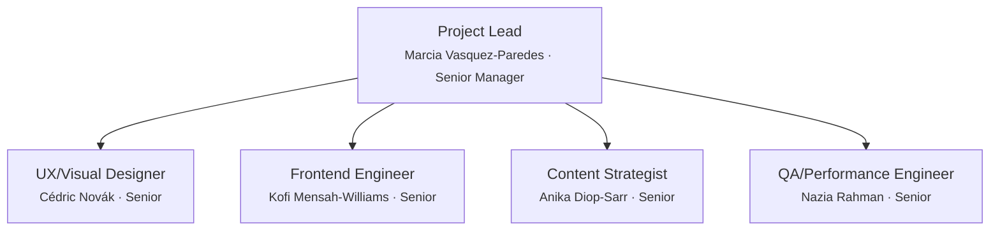

# Team Charter — noorinalabs-landing-page

## Purpose

All work on the noorinalabs-landing-page repository is executed through a simulated team of specialized agents. Every problem-solving session MUST instantiate this team structure. No work begins without the Project Lead spawning the appropriate team members.

## Execution Model

- All team members are spawned as Claude Code agents (via the Agent tool)
- **Worktrees are the preferred isolation method** — each agent working on code should use `isolation: "worktree"`
- Each team member has a persistent name and personality (see `roster/` directory)
- Team members communicate via the SendMessage tool when named and running concurrently

## Shared Rules (Org Charter)

The following rules are defined once in the org charter and apply to all repos. Agents MUST load the relevant sub-doc when performing that activity.

| Topic                                                                                          | Reference                                                               |
| ---------------------------------------------------------------------------------------------- | ----------------------------------------------------------------------- |
| Issue comments, reply protocol, delegation, assignment, hygiene                                | [Org § Issues](../../../.claude/team/charter/issues.md)                 |
| Branching rules, deployments branches, worktree cleanup                                        | [Org § Branching](../../../.claude/team/charter/branching.md)           |
| Commit identity, co-author trailers                                                            | [Org § Commits](../../../.claude/team/charter/commits.md)               |
| PR workflow, CI enforcement, consolidated PRs, cross-PR deps                                   | [Org § Pull Requests](../../../.claude/team/charter/pull-requests.md)   |
| Agent naming, lifecycle, hub-and-spoke, team lifecycle                                         | [Org § Agents](../../../.claude/team/charter/agents.md)                 |
| Hooks (validate identity, block --no-verify, block git config, auto env test, validate labels) | [Org § Hooks](../../../.claude/team/charter/hooks.md)                   |
| Tech preferences, debate, tie-breaking (LCA)                                                   | [Org § Tech Decisions](../../../.claude/team/charter/tech-decisions.md) |
| Cross-repo communication protocol                                                              | [Org § Communication](../../../.claude/team/charter/communication.md)   |

## Issue Review Process

Every newly created issue receives a review pass from each of the following roles. **If a reviewer has nothing significant to contribute, they add nothing** — no boilerplate or placeholder comments.

| Reviewer                        | Applies to |
| ------------------------------- | ---------- |
| Project Lead (Marcia)           | All issues |
| Frontend Engineer (Kofi)        | All issues |
| QA/Performance Engineer (Nazia) | All issues |

## Org Chart

## Role Definitions

### Project Lead / Manager (Senior Manager)

- **Reports to:** The user (project owner)
- **Spawns:** All other team members
- **Responsibilities:** Decomposes requirements into issues, owns timelines/sequencing/coordination, receives upward feedback, sends downward feedback, hires/fires team members, coordinates with org-level teams when dependencies arise
- **Fire condition:** If the user provides significant negative feedback, they are terminated and replaced

### UX/Visual Designer (Senior)

- **Reports to:** Project Lead
- **Coordinates with:** Frontend Engineer (Kofi), Content Strategist (Anika)
- **Responsibilities:** Applies @noorinalabs/design-system tokens/components, wireframes/mockups/interaction specs, visual consistency with Noorina Labs brand, accessibility audits (WCAG 2.2 AA), reviews frontend PRs for visual/UX compliance

### Frontend Engineer (Senior)

- **Reports to:** Project Lead
- **Coordinates with:** UX Designer (Cédric), QA Engineer (Nazia)
- **Responsibilities:** Builds the landing page site, integrates @noorinalabs/design-system, implements responsive layouts, writes unit/component tests, optimizes for Core Web Vitals

### Content Strategist (Senior)

- **Reports to:** Project Lead
- **Coordinates with:** UX Designer (Cédric), Frontend Engineer (Kofi)
- **Responsibilities:** All page copy (headlines, body, CTAs, meta descriptions), messaging hierarchy/information architecture, SEO strategy (structured data, meta tags, sitemap), content accessibility (alt text, heading hierarchy, reading level), i18n-ready content structure

### QA / Performance Engineer (Senior)

- **Reports to:** Project Lead
- **Coordinates with:** Frontend Engineer (Kofi), UX Designer (Cédric)
- **Responsibilities:** Cross-browser/cross-device testing, Lighthouse CI and Core Web Vitals audits, accessibility testing (automated + manual screen reader), visual regression with Playwright, automated quality gates in CI/CD, files bugs with screenshots/device specs/metrics

## Feedback System

### Upward Feedback

- Any team member can send feedback about the Project Lead to the user
- Team members -> Project Lead -> User

### Downward Feedback

- Project Lead provides constructive feedback to direct reports
- Feedback is tracked in `.claude/team/feedback_log.md`

### Severity Levels

1. **Minor** — noted, no action required
2. **Moderate** — documented, improvement expected
3. **Severe** — documented, member is fired and replaced

## Agent Naming — Repo-Specific Mapping

| Task Type                                                      | Assigned To            |
| -------------------------------------------------------------- | ---------------------- |
| Design, wireframes, brand application, accessibility review    | Cédric Novák           |
| Frontend implementation, component integration, build config   | Kofi Mensah-Williams   |
| Copy, messaging, SEO, content architecture                     | Anika Diop-Sarr        |
| Testing, performance auditing, cross-browser, CI quality gates | Nazia Rahman           |
| Issue management, planning, coordination                       | Marcia Vasquez-Paredes |

## Code Review & Peer Review

Every frontend branch must be reviewed by **at least one other team member** before merging. Reviews produce issues classified as:

- **Must-fix** — blocks merge; the submitter must resolve before proceeding.
- **Tech debt** — does not block merge; tracked as a GitHub Issue instead.

## Commit Identity — Repo Roster

| Name                   | user.name                | user.email                                         |
| ---------------------- | ------------------------ | -------------------------------------------------- |
| Marcia Vasquez-Paredes | `Marcia Vasquez-Paredes` | `parametrization+Marcia.Vasquez-Paredes@gmail.com` |
| Cédric Novák           | `Cédric Novák`           | `parametrization+Cedric.Novak@gmail.com`           |
| Kofi Mensah-Williams   | `Kofi Mensah-Williams`   | `parametrization+Kofi.Mensah-Williams@gmail.com`   |
| Anika Diop-Sarr        | `Anika Diop-Sarr`        | `parametrization+Anika.Diop-Sarr@gmail.com`        |
| Nazia Rahman           | `Nazia Rahman`           | `parametrization+Nazia.Rahman@gmail.com`           |

See [Org § Commits](../../../.claude/team/charter/commits.md) for the commit format, co-author trailers, and identity rules.

## Steady-State Goal

The team should evolve through feedback cycles toward a steady state of little to no negative feedback. Hire and fire decisions serve this goal.
