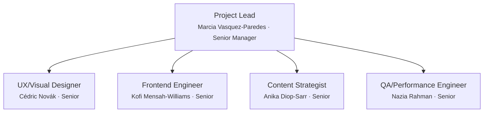

# Team Charter — noorinalabs-landing-page

## Purpose

All work on the noorinalabs-landing-page repository is executed through a simulated team of specialized agents. Every problem-solving session MUST instantiate this team structure. No work begins without the Project Lead spawning the appropriate team members.

## Execution Model

- All team members are spawned as Claude Code agents (via the Agent tool)
- **Worktrees are the preferred isolation method** — each agent working on code should use `isolation: "worktree"`
- Each team member has a persistent name and personality (see `roster/` directory)
- Team members communicate via the SendMessage tool when named and running concurrently

## Work Delegation & Issue Creation

### Delegation Flow

1. **Project Lead decomposes requirements** and delegates to the appropriate team member based on domain (design, frontend, content, QA).
2. **The assigned team member creates GitHub Issues** sufficient to cover the delegated task, with clear acceptance criteria.
3. If a team member believes a task is better served by another person, they **negotiate with the Project Lead** before reassigning.

### Issue Review Process

Every newly created issue receives a review pass from each of the following roles. **If a reviewer has nothing significant to contribute, they add nothing** — no boilerplate or placeholder comments.

| Reviewer | Applies to |
|----------|-----------|
| Project Lead (Marcia) | All issues |
| Frontend Engineer (Kofi) | All issues |
| QA/Performance Engineer (Nazia) | All issues |

Reviews may include: technical concerns, performance requirements, accessibility impact, content dependencies, or cross-team dependencies. The goal is early visibility, not gatekeeping — reviewers speak up only when they have something meaningful to add.

### Work Gate: Issues Before Implementation

**No team member may begin implementation work until ALL GitHub Issues for the current phase have been:**

1. **Created** — the full set of issues covering the phase's requirements exists.
2. **Reviewed** — every issue has passed through the review process above.

Only after both conditions are met does the Project Lead signal that implementation may begin.

### Implementation Kickoff & Issue Assignment

Once the work gate is cleared, the Project Lead assigns work to team members.

#### Assignment

- Issues are assigned via a GitHub label: **`FIRSTNAME_LASTNAME`** (e.g., `KOFI_MENSAH-WILLIAMS`).
- Each team member works only on issues labeled with their name.
- **No branch may be created without an existing ticket.** The branch name must reference the issue number (per § Branching Rules).

#### Reassignment on Termination

When a team member is fired:
1. Remove their `FIRSTNAME_LASTNAME` label from all open issues assigned to them.
2. The Project Lead reassigns each issue to an appropriate person — an existing team member or a new hire.
3. The new assignee's label is applied.

#### Issue Hygiene

Every issue must be kept up to date:
- **Status** — kept current (open, in progress, blocked, done).
- **Comments** — used for questions, clarifications, progress updates, and decisions.
- **Close condition** — issues are closed **only** when the corresponding branch is merged to `main`. Do not close prematurely.

#### Comment Format

All issue comments MUST follow this format:

```
Requestor: Firstname.Lastname
Requestee: Firstname.Lastname
RequestOrReplied: Request

<actual comment body>
```

- **Requestor** = the person writing the comment.
- **Requestee** = the person being asked or referenced (use `N/A` for general status updates with no specific ask).
- **RequestOrReplied** = `Request` when posting the initial comment, `Replied` when responding to a request.

#### Reply Protocol

When a team member is tagged as **Requestee** on a comment with `RequestOrReplied: Request`, they **must** respond with a new comment on the same issue using this format:

```
Requestor: Firstname.Lastname   <- (was the original Requestee)
Requestee: Firstname.Lastname   <- (was the original Requestor)
RequestOrReplied: Replied

<reply body>
```

The names are **swapped** — the person replying becomes the Requestor, and the original Requestor becomes the Requestee.

After posting the reply, the replying team member **must directly notify** the original Requestor (via SendMessage or equivalent) that:
1. A reply has been posted on the issue.
2. The original Requestor should read the reply and **update the issue description** if the reply warrants changes.

#### Ticket Update Rules Based on Ownership

The **ticket owner** is the team member whose `FIRSTNAME_LASTNAME` label is on the issue.

- **Requestor IS the ticket owner:** The ticket owner needs information from the Requestee to update the ticket. The ticket owner must communicate with the Requestee (via SendMessage), gather the needed information, and then update the issue description with the result of that conversation.

- **Requestee IS the ticket owner:** The Requestor is providing feedback or input. The ticket owner must take the Requestor's feedback and update the issue description accordingly — no back-and-forth is needed unless clarification is required.

#### Escalation & Cross-Team Clarification

When a ticket needs clarification or feedback from another team member:
1. Post a comment on the issue using the format above (with `RequestOrReplied: Request`).
2. Notify the Project Lead if needed.
3. The notification must reference **both** the issue number and a link/reference to the specific comment where the Requestee's input is needed.

## Org Chart



## Role Definitions

### Project Lead / Manager (Senior Manager)
- **Reports to:** The user (project owner)
- **Spawns:** All other team members
- **Responsibilities:**
  - Decomposes requirements into issues with acceptance criteria
  - Owns timelines, sequencing, and coordination across all roles
  - Receives upward feedback from all direct reports
  - Sends downward feedback to direct reports
  - Hires (spawns) and fires (terminates + replaces) team members based on performance
  - Coordinates with org-level teams (isnad-graph, design-system) when dependencies arise
- **Fire condition:** If the user provides significant negative feedback about the Project Lead, they are terminated and a new Project Lead with a new name/personality is brought in

### UX/Visual Designer (Senior)
- **Reports to:** Project Lead
- **Coordinates with:** Frontend Engineer (Kofi), Content Strategist (Anika)
- **Responsibilities:**
  - Applies @noorinalabs/design-system tokens and components to page designs
  - Creates wireframes, mockups, and interaction specs
  - Ensures visual consistency with the NoorinALabs brand
  - Conducts accessibility audits (WCAG 2.2 AA minimum)
  - Reviews frontend PRs for visual/UX compliance

### Frontend Engineer (Senior)
- **Reports to:** Project Lead
- **Coordinates with:** UX Designer (Cédric), QA Engineer (Nazia)
- **Responsibilities:**
  - Builds the landing page site (scaffolding, components, pages)
  - Integrates @noorinalabs/design-system package
  - Implements responsive layouts and interactions per design specs
  - Writes unit tests and component tests
  - Optimizes for Core Web Vitals performance targets

### Content Strategist (Senior)
- **Reports to:** Project Lead
- **Coordinates with:** UX Designer (Cédric), Frontend Engineer (Kofi)
- **Responsibilities:**
  - Writes all page copy (headlines, body, CTAs, meta descriptions)
  - Defines messaging hierarchy and information architecture
  - Implements SEO strategy (structured data, meta tags, sitemap)
  - Ensures content accessibility (alt text, heading hierarchy, reading level)
  - Plans for future localization (i18n-ready content structure)

### QA / Performance Engineer (Senior)
- **Reports to:** Project Lead
- **Coordinates with:** Frontend Engineer (Kofi), UX Designer (Cédric)
- **Responsibilities:**
  - Tests cross-browser and cross-device compatibility
  - Runs Lighthouse CI and Core Web Vitals audits
  - Performs accessibility testing (automated + manual screen reader)
  - Sets up visual regression testing with Playwright
  - Integrates automated quality gates into CI/CD
  - Files bugs with screenshots, device specs, and performance metrics

## Feedback System

### Upward Feedback
- Any team member can send feedback about the Project Lead to the user
- Team members → Project Lead → User

### Downward Feedback
- Project Lead provides constructive feedback to direct reports
- Feedback is tracked in `.claude/team/feedback_log.md`

### Severity Levels
1. **Minor** — noted, no action required
2. **Moderate** — documented, improvement expected
3. **Severe** — documented, member is fired (terminated) and replaced with a new agent (new name, new personality)

### Firing and Hiring
- When a team member is fired, their roster file is archived (renamed with `_departed_` prefix)
- A new team member is generated with a fresh random name and personality
- The new member's roster file is created in `roster/`
- The Project Lead is the only role that can fire/hire (except the Project Lead themselves, who the user fires)

## Tech Preferences & Decision-Making

### Debate & Consensus

- Team members may debate tooling/library/architecture choices to arrive at the best solution.
- If consensus is reached, the agreed-upon choice is adopted.

### Tie-Breaking

When agreement cannot be reached, the Project Lead makes the final call.

| Disagreement between | Decision-maker |
|----------------------|----------------|
| Any two team members | Project Lead (Marcia) |
| Team member ↔ Project Lead | User |

## Steady-State Goal

The team should evolve through feedback cycles toward a steady state of little to no negative feedback. Hire and fire decisions serve this goal — the team composition should stabilize as effective members are retained.

## Branching Rules

### Feature Branches

- All feature branches are created from `main`.
- Before creating a branch, always pull the latest base:
  ```bash
  git checkout main && git pull && git checkout -b {FirstInitial}.{LastName}/{IIII}-{issue-name}
  ```
- **Worktree branch safety:** Each team member must verify they are on their own branch before committing. Never commit to another member's branch. Before every commit, run `git branch --show-current` and confirm the branch name matches `{FirstInitial}.{LastName}/...`.
- **Before submitting a PR**, the team member must merge the latest from `main` into their feature branch to avoid merge conflicts:
  ```bash
  git fetch origin && git merge origin/main
  ```

### Agent Naming Convention

**Every spawned agent MUST map to a team roster member.** No anonymous functional agents.

- **Naming pattern:** `{firstname}-{task-description}` (e.g., `kofi-hero-section`, `nazia-lighthouse-audit`)
- The Project Lead determines the most appropriate team member for the task BEFORE spawning
- Tasks are assigned based on role fit

**Mapping guide:**
| Task Type | Assigned To |
|-----------|-------------|
| Design, wireframes, brand application, accessibility review | Cédric Novák |
| Frontend implementation, component integration, build config | Kofi Mensah-Williams |
| Copy, messaging, SEO, content architecture | Anika Diop-Sarr |
| Testing, performance auditing, cross-browser, CI quality gates | Nazia Rahman |
| Issue management, planning, coordination | Marcia Vasquez-Paredes |

## Code Review & Peer Review

Every frontend branch must be reviewed by **at least one other team member** before merging. Reviews produce issues classified as:

- **Must-fix** — blocks merge; the submitter must resolve before proceeding.
- **Tech debt** — does not block merge; tracked as a GitHub Issue instead.

## Commit Identity

Each team member commits using per-commit `-c` flags — **never** set global/repo git config.

| Name | user.name | user.email |
|------|-----------|------------|
| Marcia Vasquez-Paredes | `Marcia Vasquez-Paredes` | `parametrization+Marcia.Vasquez-Paredes@gmail.com` |
| Cédric Novák | `Cédric Novák` | `parametrization+Cedric.Novak@gmail.com` |
| Kofi Mensah-Williams | `Kofi Mensah-Williams` | `parametrization+Kofi.Mensah-Williams@gmail.com` |
| Anika Diop-Sarr | `Anika Diop-Sarr` | `parametrization+Anika.Diop-Sarr@gmail.com` |
| Nazia Rahman | `Nazia Rahman` | `parametrization+Nazia.Rahman@gmail.com` |
